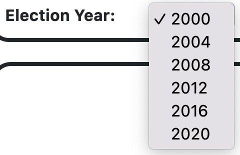
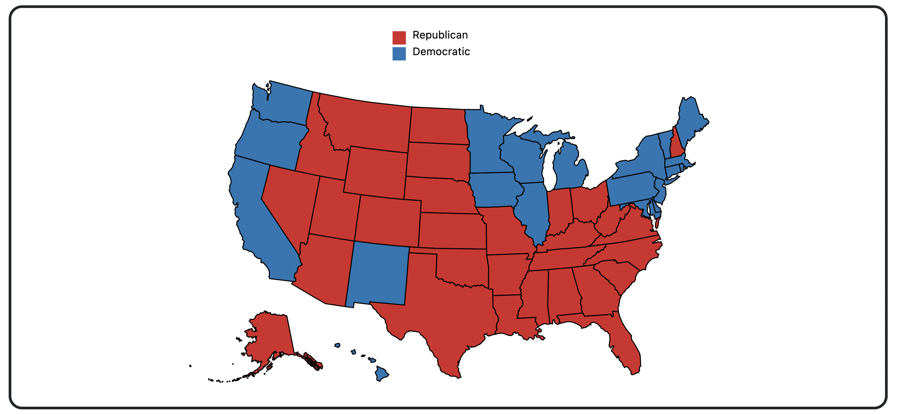

# Homework: D3 Maps

The purpose of this homework is to teach you some basic grammar and functionalities contained in D3.js. You will also learn how to draw and label geographic maps. By the end of this assignment, you should be able to:

* Load multiple datasets
* Preprocess datasets
* Perform DOM selections and dynamically update the visualized attributes
* Create map boundaries
* Use the D3 domain, range, and scale functions
* Color the different regions of a map
* Add legends for graph
* Add dynamic tooltips for more interactive solutions

The starter codes for homework assignments is given in D3 version v7, which is the latest version of D3. 

## Purpose
A map helps the viewers to visualize a dataset a geographical dataset better. In this assignment, we will be implementing a simplified version of The American Presidency Project (https://www.presidency.ucsb.edu/statistics/elections) that helps the viewers analyze the results of all the U.S. Presidential Elections. For this assignment, we are just interested in analyzing the trends of the recent elections (starting from 2000). 

## Dataset
This assignment provides one JSON file in the `data/` folder: `us-states.json` that contains the coordinates of a state-wise map of the US. 

You need to download the remaining datasets and place them in the `data/` folder. 

More information about where to access the dataset from is given in Step 3.

## To Start the Assignment
* Clone this code to your local machine.
* Using a local server (such as HTTP Simple Server), open the **index.html** file. Remember, homeworks will be graded using Firefox and Python's HTTP Simple Server.
* Modify the source code according to the instructions below.
* Commit and push the code back to this repository to submit your assignment. The finished page in `index.html` should look like this:

## Assignment Steps

### Step 0: Let's get Started 
In the HTML file's `body` section, add your name and email.

### Step 1: Create the SVG holder
In the HTML file, there is a div with the id `my_dataviz`. Create an `svg` element inside this div. Remember to give your `svg` element a suitable height and width.

> 🔍 **Note:** You can add the `svg` directly in the HTML or via Javascript in the `js/main.js` file.

### Step 2: Add a Dropdown
Create a `select` dropdown element in `index.html` where indicated by comments and add 6 years as options for the dropdown (2000, 2004, 2008, 2012, 2016 and 2020). Then, add code so that, when the year in the `select` is changed, the values of the election winners are updated and the draw map function in `js/main.js` is called. 

> 🔍 **Hint:** There's multiple ways to do this! For example, you could add an `onchange` event, or create an event listener using Javascript. 

The finished dropdown should look like this:

### Step 3: Download the Dataset 
You can download the state-wise election results from 1976-2020 from MIT Election Lab https://electionlab.mit.edu/. Look for the dataset titled `U.S. President 1976–2020` and use filters like election type (federal) and units (by state) to make your search easy. 
Additionally, you need to download the election results which can be found here: https://www.kaggle.com/datasets/brandonconrady/us-presidential-election-results-1788-2020. Look for the file titled Winners.csv and download it to your `data/` folder.

### Step 4: Prepare and Load the Data
There is a lot of data present in the `data/` folder that we do not need. You can either work off the existing datasets or filter and process only the useful information. 

From the MIT election labs data, you just need to work with the columns year, state, candidatevotes and party\_simplified. You can also filter rows which have year <2000 and whose party\_simplified is either DEMOCRAT or REPUBLICAN. 

From the election results data, you can filter out the column Party\_Abbrev and rows having year <2000. 

In `main.js`, the `us-states.json` file is already loaded. You also need to replace `sampleData.csv` and load your processed CSV(s). 

> 🔍 **Note:** You can either combine the relevant data to 1 CSV or have multiple CSVs.

Once the data is loaded,  store it in one or more global variables so that when the year changes we don't need to load the datasets again.

Since D3 doesn't have any information about the attribute types of the new files, it interprets every data value as a string. To use the quantatitive columns as such, you'll need to do some data wrangling to convert each row of the data to the correct numeric format. Change the attribute type of candidatevotes from string to numeric. D3's data loading functions (e.g. d3.csv) have a provision for that, which is documented [here](https://github.com/d3/d3-fetch/blob/master/README.md). You can also do the converting after you have loaded the data.

### Step 6: Update the Row
Selecting the year from the select menu should show information about the Winning Party, Winning President and winning Vice President. 

The finished row should look like this:

### Step 7: Complete the Map 
We want to visualize the election results by coloring the states according to the winning party (blue for democratic party and red for republican party).

First you need to create the state-wise boundary of the US Map. For this, you can use the D3 function `geoAlberUSA` to draw the map of the United States and project the states on top of the projections by using the `geoPath` function which converts the GeoJSON to SVG paths.

Next, for a particular year and state, calculate which party got higher votes and color the state with the winning party's color.

> 🔍 **Hint:** You can use the `fill` style to provide the color 

### Step 8: Add Legends
It’s important to help your audience understand what is going on in the chart. To do this, add a legend at the top of the chart. The legend should have a square showing the colors, with labels reading "Republican" and "Democratic". 

The finished map should look like this:

### Step 9: Add Interactions
As a final step, make the chart interactive. Hovering over a state should add a tool tip containing information about the state name and the number of votes that both the parties got that year.

> 🔍 **Hint:** You can use the `mouseover` function to load the tool tip when the user hovers over a state and the `mouseout` function to remove the tool tip when the user hovers out of the state's boundaries

Once you are finished with Step 9 and you have your chart looking similar to the screenshot shared earlier, you are done! Be sure to commit and push your completed code by the deadline.